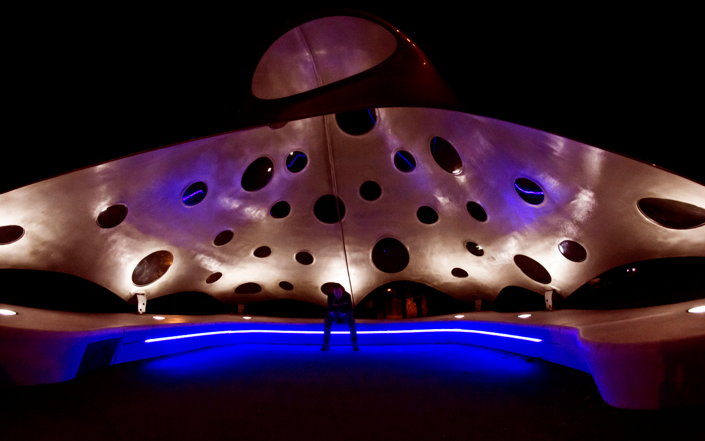

# Já jsem Zdenda

Ahoj, mé jméno je Zdeněk Janák a možná mě znáš jako astrofyzika či 
informatika. Pravdou je, že jsem stále amatérský astronom. Rád se dívám 
na hvězdy a přemýšlím o Vesmíru. Ať už je to ten nekonečně velký, ve 
kterém žijeme, nebo ten nekonečně malý, který jsme si stvořili uvnitř 
počítače.

Jelikož ani jeden z nich není o nic víc či miň reálnější než ten druhý 
a oba jsou naší součástí stejně jako my jejich, rozhodl jsem se 
připravit ti návod, jak pomocí jednoho poznat i ten druhý.

## Zpětná vazba

* Máš-li nějaké otázky či připomínky, můžeš mi zkusit napsat e-mail a 
já se ti třeba pokusím i odpovědět.

* Chceš-li mě vyprovokovat k rázné akci stran této příručky, použij 
prosím problémovou sekci na 
GitHubu <https://github.com/astrograzl/Salome/issues/>.

* Napadá-li tě nějaké vylepšení, ciť se svobodná zasáhnout do 
zdrojového kódu a já se budu těšit na tvůj požadavek o zařazení
<https://github.com/astrograzl/Salome/pulls/>.

*Z
