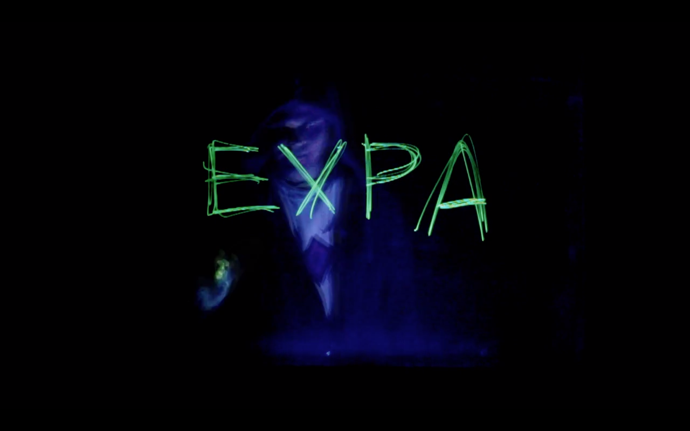

# Astronomická Expedice

Během léta máš jedinečnou možnost se seznámit se základy astronomie. A 
to na letním astronomickém festivalu **Astronomická Expedice** 
pořádaném již po desetiletí na pozemku *Hvězdárny v Úpici*. Akce 
probíhá formou stanového městečka. Denní program vyplňují odborné 
přednášky či jiné letní kratochvíle a v noci se pozoruje hluboký 
vesmír.

Během dvou týdnů se naučíš orientovat na obloze i v hvězdářských 
atlasech. Podíváš se do nejrůznějších dalekohledů. Pořídíš si snímek 
galaxie CCD kamerou. Sama si odpozoruješ a zpracuješ světelnou křivku 
proměnné hvězdy. Sestavíš si vlastní spektroskop. Poznáš spoustu 
podobných bláznů a možná se i zamiluješ.

Není to laciné a bude to náročné. Počítej s dlouhým ponocováním a 
spaním na zemi ve spacáku. Ale ta sranda za to rozhodně stojí. O 
zážitky nebude nouze až do závěrečného táboráku.

Co jsi se naučila, můžeš v posledním týdnu před začátkem podzimního 
semestru předvést na **Astronomickém praktiku** ve *Vyškově*. Na 
hvězdárně obklopené dinosaury je Hroch to nejmenší zvíře, kterého by 
ses měla bát.
