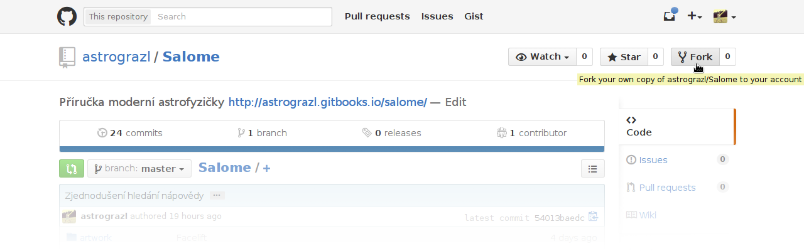

# GitHub

Programování je tvůrčí činnost, při níž zapisuješ svoje myšlenky v 
jazyce, který je srozumitelný lidem i strojům. 
[GitHub](https://github.com) je sociální síť pro sdílení zdrojového 
kódu. S jeho pomocí můžeš tvořit velkolepé projekty spolu s dalšími 
nadšenci z celého světa, nebo jen spolupracovat na seminární práci se 
svými spolužáky. V této kapitole ti ukážu jak na to. Takže jako první 
krok si vytvoř účet na stránkách GitHubu.

## Nastavení

Zatím co ve skutečném světě jsi známá svým jménem, v Internetu je 
jedinečným identifikátorem tvůj e-mail. Tím že je Gitu sdělíš, dáváš 
všem možnost poznat tvoje příspěvky

	$ git config --global user.name "Jméno Příjmení"
	$ git config --global user.email "e-mailová adresa"

Aby byl výstup Gitu přehlednější, aktivuj si v něm podporu barev

	$ git config --global color.ui true

Rovněž mu můžeš prozradit i svůj oblíbený editor, ve kterém hodláš psát 
zprávy k příspěvkům

	$ git config --global core.editor nano

## Inicializace

Nejednoduší způsob jak začít, je založit si nový repositář přímo na 
stránce GitHubu a následovat jeho instrukce. Ty obnáší inicializaci 
repositáře v adresáři projektu, který chceš přenést do Gitu

	$ git init

a přidání adresy vzdáleného repositáře, kam se tvoje příspěvky budou 
odesílat

	$ git remote add origin ...

## Informace

V každém projektu by měl být přítomný soubor s názvem `README`, který 
obsahuje popis tvého projektu. Když u něj použiješ příponu `.md`, můžeš 
text v něm formátovat pomocí Markdown. Do správy Gitu ho přidáš 
příkazem

	$ git add README.md

O aktuálním stavu repositáře, se můžeš kdykoliv přesvědčit příkazem

	$ git status

Teď nastal čas připravit tvůj příspěvek. Po zadání následujícího 
příkazu, se otevře textový editor, který sis zvolila v nastavení Gitu

	$ git commit

Do něj popiš jaké změny jsi provedla tak, aby jim rozumělo i tvé 
budoucí *já*, které ho bude číst. Po ukončení editoru (nezapomeň soubor 
uložit), můžeš svůj příspěvek odeslat do repositáře na GitHubu

	$ git push

Je praktické připravovat jednotlivé příspěvky pro dílčí změny, než 
jeden všeobsahující s nepřeberným množstvím změn.

## Kolaborace

Když chceš přispívat do existujícího projektu na GitHubu, nejprve 
proveď jeho *fork* kliknutím na příslušné tlačítko na stránce projektu. 
Tím získáš svou vlastní kopii. Můžeš si to vyzkoušet na repositáři se 
zdrojovými kódy k této příručce 
<https://github.com/astrograzl/salome/>.

Na svém osobním počítači, by jsi již měla mít kopii tohoto repositáře, 
tak do ní přejdi a aktualizuj, aby obsahovala poslední verze všech 
obsažených souborů

	$ git pull

Co se od minula změnilo se možná dopátráš v historických záznamech

	$ git log

Je na čase spojit tvou lokální kopii mého repositáře s tvým forkem na 
GitHubu. Nejprve změň jméno, které směřuje na původní repositář

	$ git remote rename origin upstream
	
Teď přidej odkaz na svůj repositář na GitHubu. Za tři tečky `...` si 
dosaď své uživatelské jméno, které jsi si zvolila při registraci

	$ git remote add origin https://github.com/.../Salome.git

A můžeš se pustit do úprav. Ty je dobré vždy provádět v oddělené větvi, 
aby sis nerozbila, co ti již spolehlivě funguje. Vytvoř tedy novou 
větev pojmenovanou po sobě zadáním příkazu

	$ git branch $(whoami)

a přepni se do ní, s využitím klávesové zkratky `Alt+.`, která 
automaticky doplní posledně zadaný parametr, aby jsi jej nemusela psát 
zbytečně dvakrát

	$ git checkout <Alt+.>

Soubor `MEMORIAL.md` je určený přímo pro tebe, aby jsi mi v něm nechala 
nějaký milý vzkaz podle vzoru mezi značkami `<!-- začátek komentáře` a 
`konec komentáře -->`, které v něm nalezneš ukryté na jeho konci. Až 
budeš hotova, můžeš provedené změny zkontrolovat příkazem

	$ git diff

Podle instrukcí v sekci Informace připrav příspěvek a odešli ho na 
GitHub. Tam následně vytvoř požadavek na přetažení své větve do mého 
repositáře. Jak na to jistě přijdeš hravě sama, jsi přece šikovná holka 
;-)

Nyní se můžeš přepnout zpět do hlavní větve repositáře

	$ git checkout master

Po nějakém čase znovu aktualizuj repositář z původního umístění

	$ git pull upstream master

Až uvidíš, že jsem tvojí změnu akceptoval, můžeš svou pracovní větev s 
klidným svědomím smazat

	$ git branch --delete $(whoami)

V této příručce zůstaneš už navěky zapsaná jako moderní 
astrofyzička[...](MEMORIAL.md)
