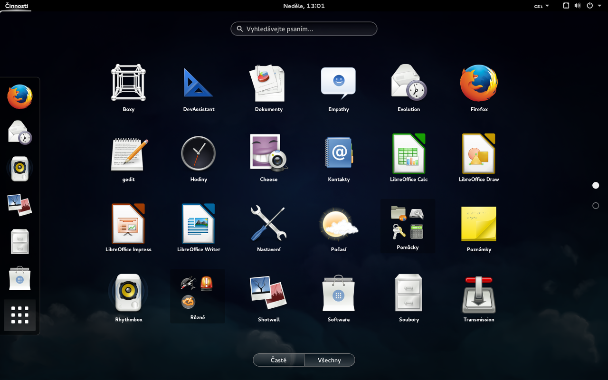

# Instalace

Ačkoliv je tato příručka dostupná on-line, na adrese 
<http://astrograzl.gitbooks.io/salome/>, je výhodné si stáhnout i její 
zdrojové kódy z repositáře <https://github.com/astrograzl/salome/>. 
Tím, kromě vlastní kopie, získáš i možnost zkoumat jak byla tvořena. 
Můžeš mi posílat návrhy na vylepšení a opravy chyb. Ale hlavně se tím i 
něco nového naučíš.


## Stažení

Repozitář se zdrojovým kódem získáš pomocí nástroje Git zadáním 
následujícího příkazu do okna Terminálu.

	$ git clone https://github.com/astrograzl/Salome.git

Že žádný Git nemáš a o nějakém Terminálu jsi v životě neslyšela vůbec 
nevadí. Celá příručka je sice plná odborných termínů okolo počítačů, 
ale se slovníčkem na konci se s nimi jistě brzo skamarádíš.


## Linux

Jsi-li hravá a ráda se učíš novým kouzlům, měla by sis jako operační 
systém na svůj osobní počítač nainstalovat Linux. Pokud si na to sama 
netroufáš, najdi si mě o přestávce v kabinetě. O Windows ani svoje data 
se bát nemusíš.



Vidím, že jsi si vybrala [Fedoru](https://getfedora.org). Za to tě mohu 
jedině pochválit, neboť modrá ti sluší. V jiné distribuci bude příkaz 
pro instalaci programů rozdílný i názvy balíčků se mohou lišit. Proto 
zde uvádím tabulku srovnávající Fodoru, Ubuntu a Arch Linux, který 
používám já.

| ? | Fedora | Ubuntu | Arch |
|---|--------|--------|------| 
| Balík | rpm |  deb | tar.xz |
| Python | 2.7.x | 2.7.x | 3.4.x |
| Instalace | `# yum install ...` | `# apt-get install ...` | `# pacman -S ...` |
| IPython Notebook | `python3-ipython-notebook` | `ipython3-notebook` | `ipython-notebook` |


## Git

Distribuovaný systém správy verzí [Git](https://git-scm.org) slouží k 
ukládání a sdílení zdrojového kódu, včetně historie jeho změn. S Gitem 
nikdy nepřijdeš o svou bakalářku nebo diplomku pár dní před jejím 
odevzdáním. Takže si otevři okno Terminálu a napiš do něj tento příkaz:

	$ sudo yum install git

a zmáčkni `Enter`. Zadej svoje heslo pro ověření, že jsi to skutečně ty 
a ani nemusíš zadržovat dech, je-li to pro tebe poprvé. Jest-li všechno 
dobře dopadlo, se můžeš ihned přesvědčit následujícím příkazem:

	$ git tip

Měla by jsi vidět tento výpis

```
git: 'tip' is not a git command. See 'git --help'.

Did you mean this?
        tag
```

Vidíš? Git je tak milý, že i když mu zadáš neplatný příkaz, tak se 
pokusí úhádnout, co jsi tím mohla myslet. V tuto chvíli by jsi měla 
poslechnout jeho rady a zkusit zadat do Terminálu

	$ git --help

tak získáš alespoň základní nápovědu, jak Git používat a dozvíš se, co 
skutečně dělá první příkaz, který jsem na tebe zkoušel v úvodu.


## Python

Teď nastal čas vyzkoušet samotný Python. Takže zpátky do Terminálu a 
zjisti verzi Pythonu, který máš nainstalovaný

	$ python --version

Hádám že to bude 2.7.x. Ten je totiž v tvém systému jako výchozí už 
předinstalován. Ty jsi ale moderní astrofyzička a tak začneme rovnou s 
aktuální verzí 3.4.x. Vše co pro začátek budeš potřebovat je
[IPython Notebook](http://ipython.org/notebook.html), respektive 
[Jupyter](https://jupyter.org), v nějž se vyvinul. Ten nainstaluješ 
včetně všech jeho závislostí jediným příkazem

	$ sudo yum install python3-ipython-notebook

A je to! Pojdmě se teď společně podívat, jaké kouzla se s tvým 
nabušeným notebookem dají dělat[...](NOTEBOOK.md)
