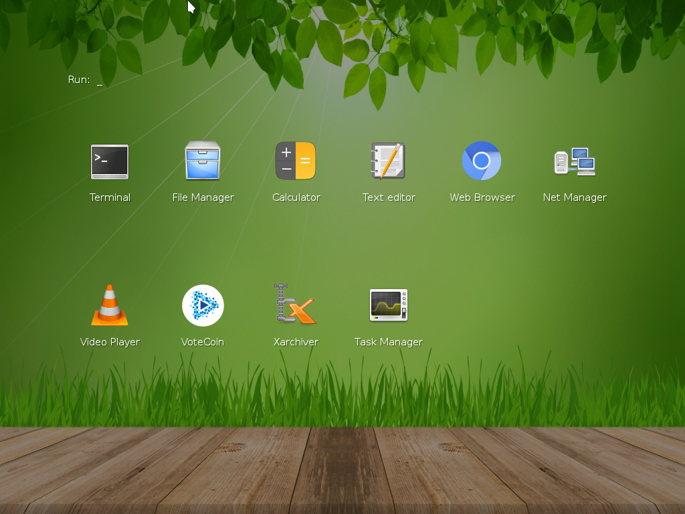

# Instalace

Ačkoliv je tato příručka dostupná on-line v Internetu, na adrese
<https://astrograzl.gitbooks.io/salome/>, je výhodné si stáhnout i její
zdrojové kódy z repositáře <https://github.com/astrograzl/salome/>. Tím,
kromě vlastní kopie, získáš i možnost zkoumat jak byla tvořena či
spouštět interaktivní tutoriály k ní přibalené. Budeš mi moct posílat
návrhy na vylepšení či opravy chyb. A třeba se tím i něco nového
naučíš.


## Stažení

Repositář se zdrojovým kódem získáš pomocí nástroje `GIT` zadáním
následujícího příkazu do okna *Terminálu*

	$ git clone https://github.com/astrograzl/Salome.git

Že žádný Git nemáš a o nějakém Terminálu jsi v životě ještě neslyšela
vůbec nevadí. Celá příručka je sice plná odborných termínů okolo
počítačů, ale než dojdeš ke slovníčku na konci, tak se s nimi jistě
stihneš skamarádit.


## Linux

Jsi-li hravá a ráda se učíš novým kouzlům, měla by sis jako operační
systém na svůj osobní počítač nainstalovat Linux. Pokud si na to sama
netroufáš, najdi si mě o přestávce v kabinetě. O Windows ani svoje data
se bát nemusíš.



Na výběr máš z mnoha možností, nad kterými se můžeš rozmýšlet klidně celý týden
a občas je i jen tak z rozmaru střídat: Debian, Ubuntu, Fedora, Mint, OpenSUSE
a mnoho dalších. Já sám používám Arch. Základ je víceméně stejný a obsažené programy se budou lišit nanejvýš aktuální verzí. Těch pár drobností, které je odlišují, třeba jak se instalují nové programy hravě zvládneš sama za večer nastudovat z wiki stránek.


## Git

Distribuovaný systém správy verzí [Git](https://git-scm.org) slouží k
ukládání a sdílení zdrojového kódu, včetně historie jeho změn. S Gitem
nikdy nepřijdeš o svou bakalářku nebo diplomku pár dní před jejím
odevzdáním. Takže si prosím otevři okno Terminálu nebo nějakého správce software
a nainstaluj si jej způsobem, který ti ve tvé vyvolené distribuci nejvíce vyhovuje.
Jest-li všechno dobře dopadlo, se můžeš ihned přesvědčit následujícím příkazem

	$ git tip

Měla by jsi vidět tento výpis

```
git: 'tip' is not a git command. See 'git --help'.

Did you mean this?
        tag
```

Vidíš? Git je tak milý, že i když mu zadáš nesmyslný příkaz, tak se
pokusí uhádnout, co jsi tím ve skutečnosti mohla myslet. V tuto chvíli
by jsi měla poslechnout jeho rady a zkusit do Terminálu zadat příkaz

	$ git --help

Tak získáš alespoň základní nápovědu, jak Git používat a třeba se i
dozvíš, co skutečně dělá onen první příkaz, který jsem na tebe zkoušel
hned v úvodu.


## Python

Teď nastal čas vyzkoušet samotný Python. Takže zpátky do Terminálu a
zjisti verzi Pythonu, který máš nainstalovaný

	$ python --version

Hádám, že to bude 2.7.x, ten je totiž ve většině systémů jako výchozí už
předinstalován, takže v tuto chvíli není třeba nic víc podnikat.


## Windows

Nebudu ti tajit, že je možné vše potřebné nainstalovat i přímo do tvých
Windows a to i na tabletu. Jen v případě, že se ocitneš v nesnázích si
budeš muset poradit sama.


### Git Bash

Stáhni si a nainstaluj Git z jeho webových stránek
<https://git-scm.com/download/win>. Spolu s ním získáš i barevný
Terminál, ve kterém můžeš zadávat příkazy podobně jako v Linuxu.


### Miniconda

Jako vhodnou distribuci Pythonu nejen pro Windows ti mohu doporučit
[Minicondu](http://conda.pydata.org/miniconda.html). Jen si dej dobrý
pozor, aby jsi stáhla správnou verzi (Python 3.6, 64-bit). Jupyter
Notebook a případně i další balíčky v ní nainstaluješ zadáním příkazu do
okna Terminálů, který najdeš v menu pod názvem *Git Bash*

	$ conda install jupyter seaborn

A je to! Ještě dřív než se pustíš do zkoušení všelijakých mocných
kouzel, které se s Pythonem dají dělat, připrav si virtuální prostředí,
aby jsi si ve svém systému udržela pořádek[...](VIRTUAL.md)
