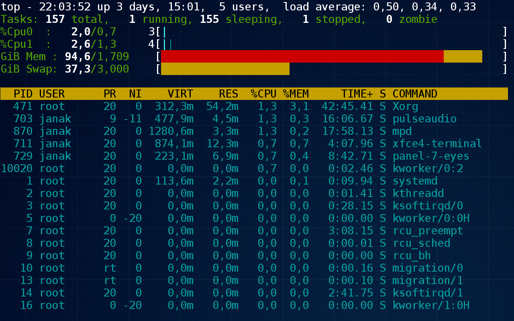

# GNU/Linux

V dávné době, kdy se příkazy počítači psaly velkými písmeny se zrodil 
systém pro sdílení strojového času UNIX. Od té doby uplynulo mnoho 
cyklů během nichž se UNIX vyvinul v Linux. Samotný Linux tvoří jádro 
operačního systému, nebo-li kernel. Spolu s volně dostupnými programy z 
rodiny GNU ho získáš v praktickém balení jako distribuci.

Jednotlivé distribuce se liší jen v detailech. Ve výchozím grafickém 
prostředí. Ve verzích obsažených programů. Způsobu konfigurace systému 
a správy balíčků s programy. V každé distribuci ale najdeš program, 
který emuluje Terminál. Tak si teď pojďme projít několik základních 
příkazů.

Příkaz se skládá z názvu programu, za kterým mohou následovat přepínače 
ovlivňující jeho chování a na konec parametry, kterými se programu 
předávají potřebné informace. Název programu bývá velmi často odvozen
jako zkratka z popisu jeho funkčnosti.

## Hledání nápovědy

Když si nevíš rady, zeptej se svého muže. Většina programů 
akceptuje přepínače `-h` nebo `--help` pro zobrazení nápovědy. Nebo ho 
prostě spusť jen tak, bez přepínačů a parametrů. Buď vypíše 
nějaké instrukce a skončí, nebo když se bude tvářít, že nic nedělá tak 
ho ukonči klávesovou zkratkou `Ctrl+C`.

	$ man
	Kterou manuálovou stránku si přejete?

Když jsi si nejsi jistá, můžeš vyhledat všechny manuály na dané téma

	$ apropos python

Pokud tě jenom zajímá co daný program dělá, není nic snazšího než 
zkusit

	$ whatis python

Prohlížeč manuálových stránek ukončíš stiskem klávesy `q`. Po stisknutí 
klávesy `h` získáš nápovědu k prohlížeči, která je platná i pro 
prohlížeč textových souborů LESS(1). Za prohlédnutí rozhodně stojí i 
samotná manuálová stránka programu MAN(1).

	$ man man

Alespoň tuhle jedinou by jsi mohla přečíst od začátku až do konce. 
Seznámíš se tak s její strukturou a příště se ti bude v dalších hledat 
už mnohem rychleji. Třeba taky zjistíš, co znamenají ty čísla za názvy 
programů.

Jako čtení na dlouhé zímní večery ti mohu doporučit Info stránky, které 
jsou rovněž součástí Linuxu a obsahuji nepřeberné množství informací. 
Dostaneš se k nim snadno

	$ info

Veškeré instrukce potřebné k jejich prohlížení se dočteš už v prvním 
odstavci. Info stránky jsou spíše takové pojednání o Linuxu a jeho 
programech. Pro praktické účely bohatě stačí občas nahlédnout do 
manuálových stránek, když si zrovna nejsi jistá, jak se který program 
přesně používá.

## Řešení problémů

Pro sledování využití prostředků počítače, tedy vytížení procesoru a 
obsazení fyzické paměti i odkládacího prostoru slouží Správci úloh ne 
nepodobný program TOP(1).

	$ top
    

Úlohy se dají řadit podle vytížení procesoru pomocí klávesové zkratky 
`Shift+P` nebo podle množství zkonzumované paměti kombinací kláves 
`Shift+M`. A to nejdůležitější, že se ukončuje klávesou `q`.

Občas se může stát, že některý program začne zlobit a přestane 
odpovídat. Pak nezbývá nic jiného než ho bez milosti zabít. Pojďme si 
cvičně takovou situaci nasimulovat. Začni tím, že v Terminálu spustíš 
program YES(1), který neděla nic jiného, než že pořád dokola vypisuje 
text, který mu předáš jako parametr.

	$ yes Please kill me!
	
Teď použij klávesovou zkratku `Ctrl+Z`, čímž jeho běh pozastavíš. 
Podívejme se na výpis všech tvých spuštěných programů, ten získaš 
pomocí příkazu

	$ ps x

Vidíš to zoufalé žadonění o popravu jen pár řádek před koncem? Nebuď 
tedy sadistická a déle to neprotahuj. Raději jeho trápení rychle a 
bezbolestně ukonči.

	$ kill -9 ####
	
Za znaky `####` musíš dosadit správny PID, tedy to číslo z prvního 
sloupce, ale dej si dobrý pozor, aby jsi ho opsala ze správného řádku. 
Jistější přeci jen bude ho zkopírovat a vložit.
