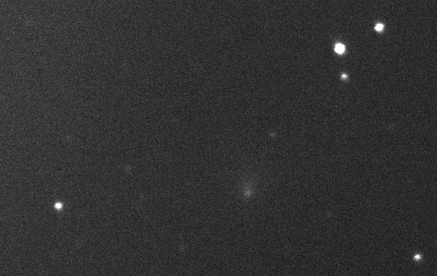

# Munipack

Je krásné podzimní odpoledne, tam venku za okny do botanické zahrady. Ale moderní astrofyzička nehledě na kvalitu laku na nehtech hrdě sedí u svého mainframu v kabinetu a po síti zpracovává snímky komety pořízené minulou noc. Data k tomuto praktickému cvičení najdeš ve složce

    (Salome)$ cd data/kometa

Jedná se o sérií dvaceti snímků komety *C/2013 X1 PANSTARRS*, pořízené studenty Astronomického praktika, na observatoři Kraví Hora, v prozatímním vlastnictví Masarykovy Univerzity. Podporované rovněž sedmicí temných snímků s třiceti sekundovou expoziční dobou. Přiložený textový soubor obsahuje všechny potřebné informace o kometě pro okamžik jejího pozorování.

## Krok číslo nula

Na začátku je potřeba roztřídit pořízené snímky. Ty jsi ale byla šikovná už při pozorování, dokonce tak že, jsi volila smysluplné názvy souborů a starala se také, aby byla řádně vyplněná hlavička každého snímku. Tak tento krok můžeme s klidem ve svědomí přeskočit a rovnou se pustit do rozbalování dárků

    $ funpack *.fz

## Temný snímek

První a v tomto případě i jediný korekční snímek, který budeme používat je tak zvaný *master dark* -- ten pomocí [Munipacku](http://munipack.physics.muni.cz/) vytvoříš snadno zadáním jediného krátkého příkazu

    $ munipack dark dark_30_*.fits

Výsledek si můžeš prohlédnout v jeho grafické nadstavbě pomocí příkazu

    $ xmunipack dark.fits
    
Než se pustíš do dalšího zpracování, je třeba mít na paměti, že při každé změně snímku vzniká i záloha jeho předchozí verze, což ve výsledku vede k rychlému úbytku volného místa na disku. Aby jsi tomu předešla, bohatě postačí, když si jednorázově nastavíš proměnnou prostředí, která tomuto chování zabrání.
    
    $ VERSION_CONTROL=off

## Fotometrická korekce

V tomto případě provedeš jen nezbytnou korekci o průměrný temný snímek, který sis před chvíli připravila. Pravda, hodil by se i dobrý *flat field*, ale ten žel teď k dispozici nemáš.

    $ munipack phcorr -dark dark.fits X1*.fits

## Hledání hvězd

Pro úspěšné nalezení i těch nejslabších hvězd na snímku, je občas třeba vyladit volby parametrů pro vyhledávací algoritmus v podobě vhodně zvolených čísel pro přepínače `-f` a `-th`.

    $ munipack find -f 7 X1*.fits
    

## Aperturní fotometrie

Teď už nic nebrání provedení aperturní fotometrie pro všechny nalezené hvězdy.

    $ munipack aphot X1*.fits

## Astrometrie

Ztotožnění tebou pořízeného snímku s katalogem je otázkou jen dvou kroků. Dnes už se ale nechodí vyhledávat do knihovny s disketou na stažené data, ale přímo z terminálu rovnou do cloudu. Katalog známých hvězd v určitém okolí zadaných nebeských souřadnic stáhneš pomocí Munipacku zadáním mocného příkazu

    $ munipack cone 60.203 45.539

Kde získáš správné souřadnice je už jen na tobě, cest je několik[.][0][.][1][.][2] Na jejím konci pak už jen zbývá provést samotnou astrometrickou kalibraci

    $ munipack astrometry X1*.fits

[0]:  #  "Podívej se do hlavičky"
[1]:  http://nova.astrometry.net/uploud  "Nahraj snímek na Astrometry.net"
[2]:  telnet://ssd.jpl.nasa.gov:6775  "$ telnet ssd.jpl.nasa.gov 6775"

## Kompozice

Občas se hodí všechny pořízené snímky složit dohromady v jeden celek. Na něm pak vyniknou slabé detaily, které na jednotlivých snímcích nebyly vidět. V tomto konkrétním případě uvidíš pohyb komety mezi okolními hvězdami a na druhém snímku, jsi-li pozorná, si možná všimneš i dvou ohonů.

    $ munipack kombine --rcen ? --dcen ? -o kometa.fits X1*.fits

