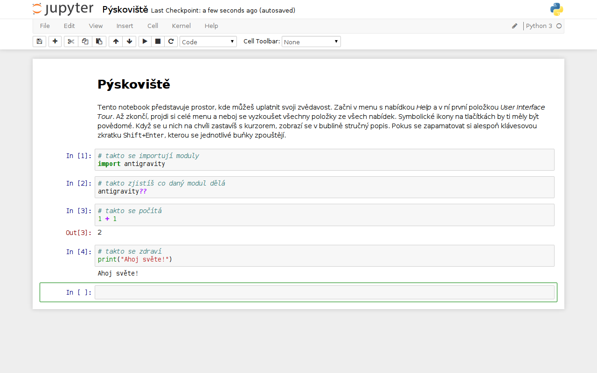

# Notebook

Za svou krátkou historii vystřídaly počítače mnoho podob. Staré sálové 
počítače byly nahrazeny výkonnějšími mainframy. Doma pod stolem zavazí 
při vysávání desktop. A na stole zase laptop. Možná si mě právě teď 
prohlížíš na tabletu či smartphonu, i ty jsou počítačem. Stejně jako 
chytrá televize, hodinky nebo lednička. Plus ty milióny anonymních 
serverů, které neustále běží v datových centrech propojeny sítí 
Internet. A ty všechny rozumí jazyku Python.

## Tablet

Aby byl osobní počítač ideálním pomocníkem, musí ti poskytovat dostatek 
komfortu. Tablet je sice pěkná hračka, ale uznej sama, že komunikovat s 
počítačem pomocí 104 kláves všemi deseti je přinejmenším desetkrát 
rychlejší, než jedním prstem klikat na barevné obrázky. Notebook jako 
klávesnice spojená s monitorem v kompaktním a hlavně přenosném 
provedení se mě osobně jeví jako rozumné řešení dostatečně výkonné 
pracovní stanice.

## IPython Notebook

Tutoriály připojené k této příručce se nacházejí v adresáři `notebooks` 
uvnitř adresáře `Salome`, který vznikl, když sis příručku klonovala z 
GitHubu. Takže račte do ní vstoupit madam

	$ cd Salome/notebooks/
	
Spouštění IPython Notebooku z Terminálu se provádí zadáním příkazu

	$ ipython notebook
	
načež by se ti ve tvém oblíbeném webovém prohlížeči měla otevřít nová 
karta na adrese <http://localhost:8888/> s přehledem dostupných 
notebooků. Nejednoduší cesta jak se s ním seznámit je si s ním chvíli 
hrát. Tak prosím klikni na **Pýskoviště.ipynb** a sama chvíli objevuj 
kouzla, která se s ním dají dělat.

Předností IPython Notebooku je, že funguje skrze webový prohlížeč, 
který používáš zcela intuitivně snad každý den. Před očima máš webovou 
stránku, ve které do připravených políček píšeš text formátovaný jako 
Markdown, vzorce zapisuješ stejně jako pro LaTeX a kód v jazyce Python 
a zároveň vidíš i jeho výstup. Když jsi s výslednou podobou celého 
notebooku spokojená, můžeš ho exportovat do HTML a vystavit na svých 
stránkách, nebo jako PDF vytisknout. A rozhodně vůbec není na škodu ho 
průběžně odesílat pomocí Gitu do repositáře na GitHubu[...](GITHUB.md)
