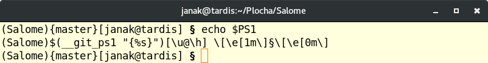

# Terminál

Za časů pravěkých, když superpočítače obývaly sály výpočetních 
středisek, jsme k nim přistupovali vzdáleně prostřednictvím modemu 
skrze pomalou telefonní linku. Jen pomocí Terminálu. Ale dnes v době 
MetaCentra a ADSL i v naší vesnici je situace naprosto stejná. Svět se 
za tu dobu moc nezměnil, ale Terminály nám zůstaly věrny. Dříve byl 
Terminál klávesnice a monitor v hranaté krabici. Dnes je Terminál 
aplikace jako každá jiná, jenž svým minimalizmem dosáhla absolutní 
dokonalosti. Terminál je prostředník pro komunikaci mezi člověkem a 
počítačem. Příkazy, které do něj zadáváš představují vstup. Zprávy 
které ti vypisuje jsou výstup. Ovládání počítače skrze Terminál se v 
principu neliší od toho, když spolu po večerech chatujeme. Jen na druhé 
straně linky nesedí člověk, ale naslouchá stroj.

## Bash

Terminál jako takový je v podstatě jen kontejner pro další programy. 
První se kterým přijdeš do kontaktu je takzvaný shell. V Linuxu 
konkrétně `BASH`. To on interpretuje příkazy, které mu zadáváš, 
případně spouští další programy podle potřeby. Ovládání počítače pomocí 
shellu je už pokročilou magií. Není činnost na počítači, která by nešla 
vykonat v shellu.

## Skript

Příkazy pro shell můžeš zapsat do textového souboru s příponou `.sh`. 
Ten předáš Bashi ke spuštění například takto

	$ bash muj_skript.sh

A zatím co on je vykonává ty si můžeš jít třeba nakoupit. Pamatuj, že 
jakákoliv činnost, kterou na počítači provádíš opakovaně se dá 
automatizovat. V adresáři `scripts` nalezneš několik snad užitečných 
skriptů pro inspiraci.

## Prompt

Text před (blikajícím) kurzorem se nazývá *prompt* a je to způsob, jak 
ti shell dává najevo, že od tebe očekává příkazy. Jeho symbolický zápis 
je uložen v proměnné prostředí `PS1`. Ostatně zkus si ji vypsat sama

	$ echo $PS1

Chápej ho jako kouzelný proutek, který neprodleně vykoná příkazy tebou zapsané
a navíc umí i ukazovat zajímavé informace včetně aktuálního času, případně všeho,
co si nastavíš a v jakých barvách,... nekonče předpovědí počasí. U mě jsou to spíše věci technického charakteru:

* V kulatých `(...)` závorkách název Pythoního virtuálního prostředí
* Ve složených `{...}` závorkách aktuální větev v Gitu
* V hranatých `[...]` závorkách jméno uživatele @ počítače

Pokud se shell bude dožadovat dodatečných informací, změní svůj 
prompt na hodnotu uloženou v proměnné prostředí `PS2`, ta většinou 
obsahuje jediný znak `>`. Stejně tak každý program spuštěný v 
Terminálu a interagující s uživatelem má svůj vlastní prompt.

| Aplikace |     PS1     |  PS2   |
|----------|-------------|--------|
| Bash     | `$`         | `>`    |
| Python   | `>>>`       | `...`  |
| IPython  | `In [#]:`   | `...:` |
| Gnuplot  | `gnuplot>`  |        |
| Octave   | `octave:#>` | `>`    |

## Historie

Terminál si pamatuje historii příkazů, které do něj zadáváš. Což je 
ohromná výhoda, protože příště je nemusíš znovu celé vypisovat. Pomocí 
šipek nahoru a dolů v ní můžeš listovat a pomocí klávesové zkratky 
`Ctrl+R` vyhledávat. Nebo ji rovnou celou vypsat na obrazovku příkazem

	$ history

Pak už stačí jen do Terminálu napsat magický povel

	$ !###
	
přičemž znaky `###` nahradíš číslem ze začátku řádku ve výpisu 
historie, který by jsi chtěla provést znovu.

## Našeptávač

Další velice užitečnou funkcí Terminálu je jeho ochota ti napovídat. 
Vyzkoušej si sama, co se stane, když do něj napíšeš `py` a dvakrát 
zmáčkneš klávesu `Tab`

	$ py<Tab><Tab>

A to není všechno. Našeptávač našeptává i přepínače programů, doplňuje 
cestu k souborům i jejich názvy. Zkrátka kdykoliv se na chvíli zasekneš 
a nebudeš vědět co dál, vzpomeň si na mě a poklepej levým prsteníčkem 
na klávesu `Tab`.

## Kopírovat a vkládat

Jak se v následující kapitole dozvíš, má klávesová zkratka `Ctrl+C` 
zcela specifický význam a proto se nedá použít pro kopírování textu jak 
jsi zvyklá. Proto ti poradím další užitečnou fintu. Text z Terminálu 
zkopíruješ prostě tím, že ho označíš. To je vše. Na místo kurzoru ho 
pak vložíš kliknutím prostředním tlačítkem myši, tedy kolečkem. Pokud 
na své myši nemáš prostřední tlačítko ani kolečku, klikni oběma jejími 
oušky najednou.

Na závěr by se hodilo dodat jak Terminál ukončit. Máš několik 
možností. Nejrychlejší je klávesová zkratka `Ctrl+D`, případně můžeš 
napsat příkaz

	$ exit

nebo zavřít celé okno. Jaké všechny kouzla se dají v Terminálu dělat, 
by vydalo na celý román. V následující kapitole si vyzkoušíš alespoň 
některé z nich[...](LINUX.md)
