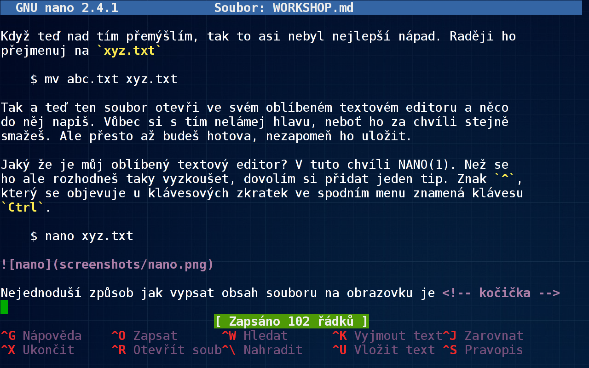

# Workshop

Už by jsi měla mít dostatek indícií, aby jsi zvládla i něco 
praktického, takže si trochu zacvičíme. Napřed přejdi do adresáře 
`/tmp`, který slouží jako dočasné odkladiště.

	$ cd /tmp

Chápu, že zvědavosti se nedá odolat, tak se klidně podívej jaké soubory 
se v něm nacházejí a komu patří

	$ ls -la

Na otázku, kdo jsi ty, ti odpoví program WHOAMI(1). Jeho výstupu a 
malého kouzla v Bashi využiješ pro vytvoření složky se svým jménem

	$ mkdir $(whoami)

Nyní vejdi do své složky pomocí příkazu `cd`, ale aby jsi nemusela psát 
na klávesnici víc než je nezbytně nutné, použij klávesovou zkratku 
`Alt+.`, která doplní posledně použitý parametr

	$ cd <Alt+.>

O své aktuální poloze se můžeš přesvědčit vypsáním pracovního adresáře

	$ pwd
	/tmp/...

Teď se pomocí programu TOUCH(1) dotkni souboru `abc.txt`. Pokud ten 
ještě neexistuje, bude vytvořen, jinak dojde jen k letmému doteku, 
který změní čas jeho posledního přístupu

	$ touch abc.txt

Když teď nad tím přemýšlím, tak to asi nebyl nejlepší nápad. Raději ho 
přejmenuj na `xyz.txt`

	$ mv abc.txt xyz.txt

Tak a teď ten soubor otevři ve svém oblíbeném textovém editoru a něco 
do něj napiš. Moc si s tím nelámej hlavu, neboť ho za chvíli stejně 
smažeš. Ale přesto až budeš hotova, nezapomeň ho uložit. Jaký že je můj 
oblíbený textový editor? V tuto chvíli zrovna NANO(1).

	$ nano xyz.txt

Jak to u mě vypadá, když píšu tyto řádky, se můžeš na vlastní oči 
přesvědčit na obrázku níže, kde je v něm zobrazena nápověda k němu 
samotnému.

Nejednoduší způsob jak vypsat obsah souboru na obrazovku je <!-- kočička -->

	$ cat xyz.txt 

Je-li moc dlouhý, že se na ní celý nevejde, použij raději program 
MORE(1) nebo ještě lépe LESS(1). Jaká je jeho skutečná velikost 
prozradí program DU(1). Počet řádek, slov a znaků zjistíš pomocí 
programu WC(1).

Pro jistotu si udělej jeho kopii, nikdy nevíš, kdy se ti bude hodit

	$ cp xyz.txt abc.txt

Nyní již můžeš svůj soubor s klidným svědomím smazat

	$ rm xyz.txt

přejít o adresář výš

	$ cd ..

a smazat i celý svůj adresář

	$ rmdir $(whoami)

A-ha! Co se stalo? Program RMDIR(1) dokáže smazat jedině prázdný 
adresář. Takže buď napřed smažeš všechny soubory v něm obsažené a pak i 
jej samotný, nebo to celé uděláš najednou

	$ rm -r $(whoami)
	
Až budeš potvrzovat, že ho chceš skutečně smazat, buď si tím naprosto 
jistá. Žádná cesta zpátky už nevede.

Šikovná holka ;-)

## Hledání (v) souboru

Věci se ti samy ztrácejí, ale v Linuxu není těžké je opětovně najít, i 
když přesně nevíš co vlastně hledáš. Pokud tušíš alespoň název souboru 
nebo znáš kousek cesty k němu, použij program LOCATE(1). Pro 
specifičtější hledání podle nejrůznějších parametrů se hodí program 
FIND(1). Pokud potřebuješ hledat uvnitř textových souborů, tak k tomu 
účelu slouží program GREP(1).

> Pomoz mi prosím najít kočičku, která se ztratila někde v gitě 
> a teď tam úzkostlivě mňauká!
<!-- `grep -sh kočička .git*` -->
