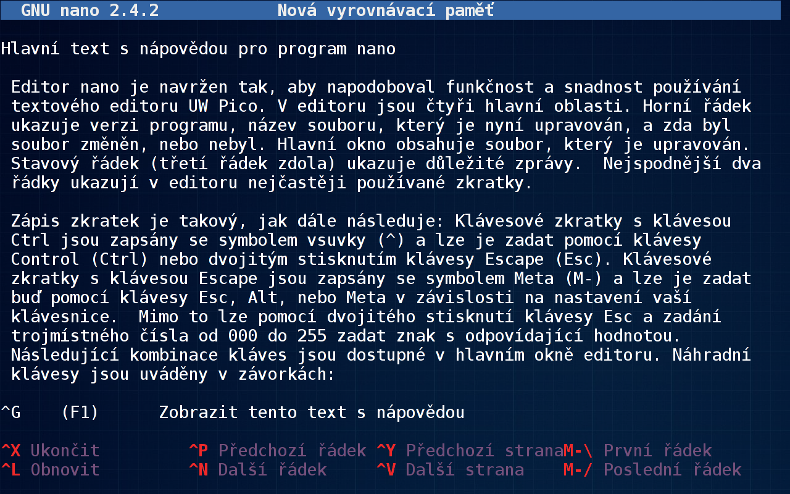

# Workshop

V tuto chvíli by jsi již měla mít dostatek indícií, aby jsi zvládla i 
něco praktického, takže si trochu zacvičíme. Napřed přejdi do adresáře 
`/tmp`, který slouží jako dočasné odkladiště

	$ cd /tmp

Chápu, že zvědavosti se nedá odolat, tak se klidně podívej jaké soubory 
se v něm nacházejí a komu patří

	$ ls -la

Na otázku, kdo jsi ty, ti odpoví program `WHOAMI`. Nový adresář 
vytvoříš příkazem `MKDIR`. Tobě teď bude stačit jen náhodně pojmenový 
adresář. Ten vytvoříš příkazem `MKTEMP`. Jeho výstupu a malého kouzla v 
Bashi použiješ k tomu, aby jsi do něj rovnou přešla

	$ cd $(mktemp -d)

O své aktuální poloze se můžeš přesvědčit vypsáním pracovního adresáře 
příkazem `PWD`. Pro další použití si tuto cestu ulož do proměnné `TEMP`

	$ TEMP=$(pwd)

Že se v ní skutečně nachází cesta k aktuálnímu adresáři se přesvědčíš 
snadno

	$ echo $TEMP

Ve svém oblíbeném textovém editoru vytvoř nový soubor a něco do něj 
napiš. Moc si s tím nelámej hlavu, neboť ho za chvíli stejně smažeš. 
Ale přesto až budeš hotova, nezapomeň ho uložit. Jaký že je můj 
oblíbený textový editor? V tuto chvíli zrovna `NANO`.

	$ nano abc.txt

Jak to u mě vypadá, když píšu tyto řádky, se můžeš na vlastní oči 
přesvědčit na obrázku níže, kde je v něm zobrazena nápověda k němu 
samotnému.

Nelíbí se ti název souboru? Není nic snazšího, než ho změnit.

	$ mv abc.txt xyz.txt

Nejednoduší způsob jak vypsat obsah souboru na obrazovku je <!-- kočička -->

	$ cat xyz.txt 

Je-li moc dlouhý, že se na ní celý nevejde, použij raději program 
`MORE` nebo ještě lépe `LESS`. Program `HEAD` zobrazí jen prvních 10 
řádků, kdežto program `TAIL` jen posledních 10, pokud si ovšem neřekneš 
jinak. Jaká je jeho skutečná velikost prozradí program `DU`. Počet 
řádek, slov a znaků v souboru zjistíš pomocí programu `WC`.

Pro jistotu si udělej jeho kopii, nikdy nevíš, kdy se ti bude hodit

	$ cp xyz.txt abc.txt

Nyní již můžeš svůj soubor s klidným svědomím smazat

	$ rm xyz.txt

přejít o adresář výš

	$ cd ..

a smazat i celý dočasný adresář

	$ rmdir $TEMP

A-ha! Co se stalo? Program `RMDIR` dokáže smazat jedině prázdný 
adresář. Takže napřed smaž i všechny zbývající soubory pomocí dotěrné 
varienty příkazu

	$ rm -i *
	
Až budeš potvrzovat, že ho chceš skutečně smazat, buď si tím naprosto 
jistá. Žádná cesta zpátky už nevede.

## Hledání (v) souboru

Věci se ti samy ztrácejí, ale v Linuxu není těžké je opětovně najít, i 
když přesně nevíš co vlastně hledáš. Pokud tušíš alespoň název souboru 
nebo znáš kousek cesty k němu, použij program `LOCATE`. Pro 
specifičtější hledání podle nejrůznějších parametrů se hodí program 
`FIND`. Pokud potřebuješ hledat uvnitř textových souborů, tak k tomu 
účelu slouží program `GREP`.

> Pomoz mi prosím najít kočičku, která se ztratila někde v gitě a teď 
> tam úzkostlivě mňauká!
<!-- `grep -sh mňau .git*` -->
