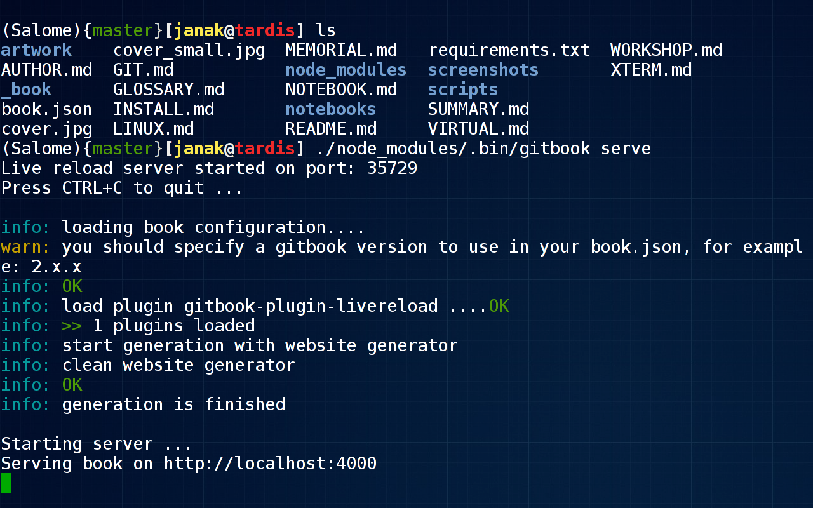

# Terminál

Za časů pravěkých, když drahé superpočítače obývaly sály výpočetních 
středisek, jsme k nim přistupovali vzdáleně prostřednictvím modemu 
skrze pomalou telefonní linku pomocí Terminálu. Ale dnes v době 
MetaCentra a ADSL i v naší vesnici je situace naprosto stejná. Svět 
se za tu dobu změnil k nepoznání, ale Terminály nám zůstaly věrny.

Dříve byl Terminál klávesnice a monitor. Dnes je Terminál aplikace jako 
každá jiná, jenž svůj minimalizmus dotáhla do absolutní dokonalosti. 
Terminál je prostředník pro komunikaci mezi člověkem a počítačem. 
Příkazy, které do něj zadáváš představují vstup. Zprávy které ti 
vypisuje jsou výstup. Ovládání počítače skrze Terminál se v principu 
neliší od toho, když spolu chatujeme, jen na druhé straně linky nesedí 
člověk, ale naslouchá stroj.

## Bash

Terminál jako takový je v podstatě jen kontejner pro další programy. 
První se kterým přijdeš do kontaktu je takzvaný shell. V Linuxu 
konkrétně Bash. On interpretuje příkazy, které mu zadáváš, případně 
spouští další programy podle potřeby. Ovládání počítače pomocí shellu 
je už pokročilou magií. Není činnost na počítači, která by nešla 
vykonat v shellu.

## Skript

Příkazy pro shell můžeš zapsat do textového souboru s příponou `.sh`. 
Ten předáš shellu ke spuštění a zatím co on jej vykonává ty si můžeš 
jít třeba nakoupit. Pamatuj, že jakákoliv činnost, kterou na počítači 
provádíš opakovaně se dá automatizovat.

	$ sh muj_skript.sh

## Prompt

Text před (blikajícím) kurzorem se nazývá *prompt* a je to způsob, jak 
ti shell dává najevo, že od tebe očekává příkazy. Jeho symbolický zápis 
je uložen v proměnné prostředí `PS1`. Ostatně zkus si ji vypsat sama

	$ echo $PS1

Normálně nebývá tak dlouhý jako můj, ale na druhou stranu mi tak 
poskytuje dostatek informací.

* V kulatých `(...)` závorkách název Pythoního virtuálního 
prostředí
* Ve složených `{...}` závorkách aktuální větev v Gitu
* V hranatých `[...]` závorkách jméno uživatele @ počítače

Pokud se shell bude dožadovat dodatečných informací, změní svůj 
prompt na hodnotu uloženou v proměnné prostředí `PS2`, ta většinou 
obsahuje jediný znak `>`. Stejně tak každý program spuštěný v 
Terminálu a interagující s uživatelem má svůj vlastní prompt.

| Aplikace |     PS1     |  PS2   |
|----------|-------------|--------|
| Bash     | `$`         | `>`    |
| Python   | `>>>`       | `...`  |
| IPython  | `In [#]:`   | `...:` |
| Gnuplot  | `gnuplot>`  |        |
| Octave   | `octave:#>` | `>`    |

## Historie

Terminál si pamatuje historii příkazů, které do něj zadáváš. To má 
ohromnou výhodu, protože příště je nemusíš znovu celé vypisovat. Pomocí 
šipek nahoru a dolů v ní můžeš listovat a pomocí klávesové zkratky 
`Ctrl+R` vyhledávat nebo ji celou vypsat příkazem

	$ history

Jaké všechny kouzla se dají v Terminálu dělat, by vydalo na celý román. 
V následující kapitole ti představím alespoň některé z 
nich[...](LINUX.md)
